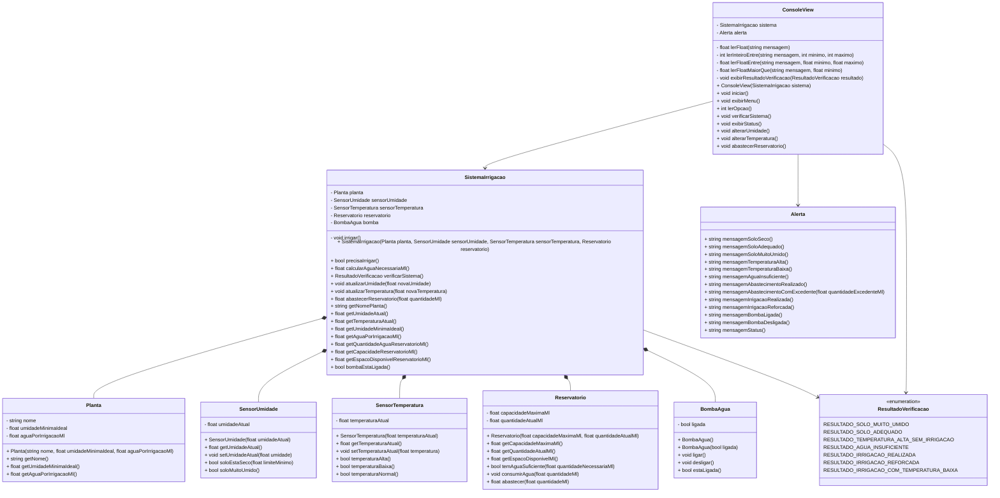

# Diagrama de Classes

Este documento atende ao pedido de diagrama de classes da proposta do projeto.

Se o arquivo estiver aberto apenas como texto no VS Code, leia primeiro o resumo abaixo. O bloco Mermaid no final serve para renderizar o diagrama visual em ferramentas compatíveis, como preview Markdown com suporte a Mermaid ou GitHub.

## Legenda

- `-` indica atributo privado.
- `+` indica método público.
- `*--` indica composição: uma classe possui a outra.
- `-->` indica uso: uma classe chama ou depende da outra.

## Resumo das Classes

| Classe | Responsabilidade |
| --- | --- |
| `Planta` | Guarda os dados da planta cadastrada. |
| `SensorUmidade` | Guarda e classifica a umidade do solo. |
| `SensorTemperatura` | Guarda e classifica a temperatura ambiente. |
| `Reservatorio` | Controla capacidade, água disponível, consumo e abastecimento. |
| `BombaAgua` | Representa se a bomba está ligada ou desligada. |
| `ResultadoVerificacao` | Enumera os resultados técnicos possíveis da verificação. |
| `SistemaIrrigacao` | Coordena as classes principais e aplica as regras de irrigação. |
| `Alerta` | Centraliza mensagens exibidas ao usuário. |
| `ConsoleView` | Lê dados, mostra menu e conversa com o usuário pelo terminal. |

## Relações Principais

- `SistemaIrrigacao` possui `Planta`, `SensorUmidade`, `SensorTemperatura`, `Reservatorio` e `BombaAgua`.
- `SistemaIrrigacao` retorna `ResultadoVerificacao` para indicar o que aconteceu.
- `ConsoleView` usa `SistemaIrrigacao` para executar as ações escolhidas pelo usuário.
- `ConsoleView` usa `Alerta` para exibir mensagens padronizadas.

## Diagrama Mermaid

